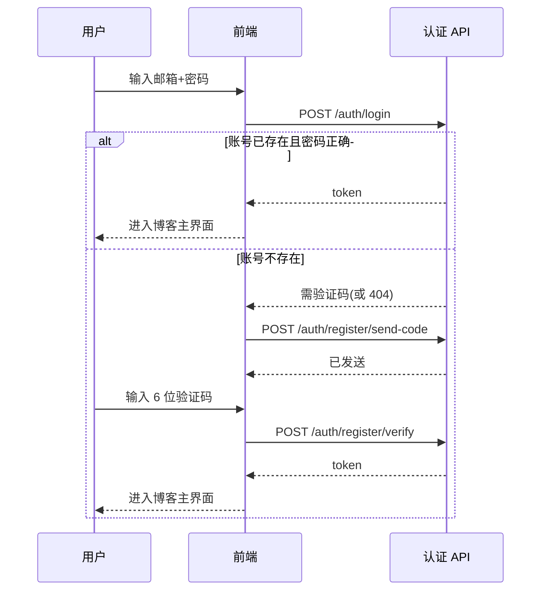
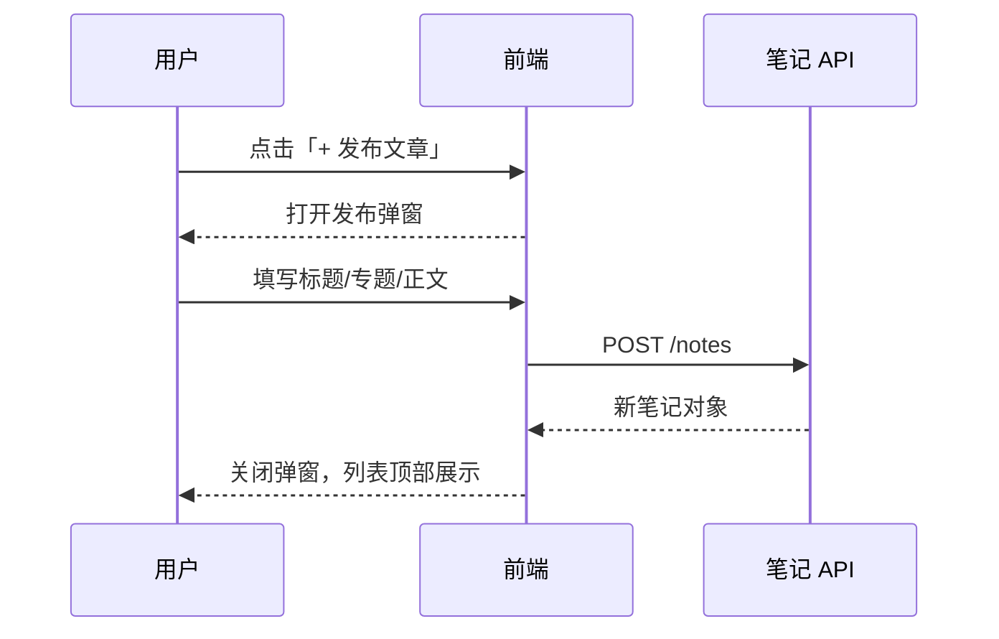
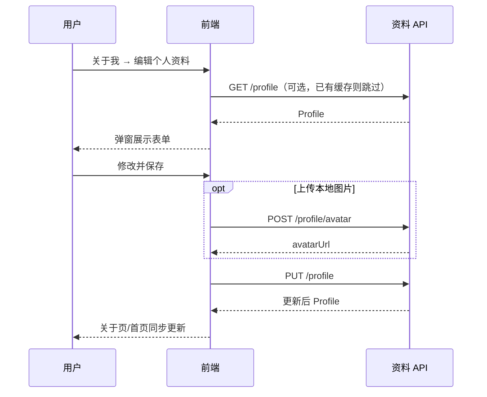

# 个人博客 API 接口文档

| 项目 | 说明 |
|------|------|
| 文档版本 | v1.0.0 |
| 对应前端 | `personal-blog`（Vue 3 + Vite） |
| 当前实现 | 浏览器 `localStorage` 本地模拟 |
| 建议服务基址 | `https://api.example.com/v1` |
| 数据格式 | JSON（`UTF-8`） |
| 鉴权方式 | JWT，`Authorization: Bearer <token>` |

---

## 目录

1. [概述](#1-概述)
2. [通用规范](#2-通用规范)
3. [数据模型](#3-数据模型)
4. [错误码](#4-错误码)
5. [认证模块](#5-认证模块)
6. [个人资料模块](#6-个人资料模块)
7. [专题模块](#7-专题模块)
8. [学习笔记模块](#8-学习笔记模块)
9. [生活记录模块](#9-生活记录模块)
10. [学习轨迹模块](#10-学习轨迹模块)
11. [业务流程](#11-业务流程)
12. [前端功能与接口对照表](#12-前端功能与接口对照表)
13. [当前 localStorage 实现](#13-当前-localstorage-实现)
14. [接口索引（速查）](#14-接口索引速查)

---

## 1. 概述

本系统为**个人学习博客**，核心能力包括：

- 用户注册 / 登录（QQ 邮箱 + 密码 + 邮箱验证码）
- 个人资料管理（头像、昵称、介绍、兴趣标签）
- 学习笔记（按专题分类，支持发布、编辑、删除、展开阅读）
- 生活记录（独立内容流）
- 学习轨迹展示（阶段复盘，当前为静态数据）

### 1.1 系统架构（建议）

```mermaid
flowchart LR
  subgraph client [前端 Vue3]
    Landing[着陆页]
    Blog[博客主界面]
    Auth[登录弹窗]
  end
  subgraph api [API 服务]
    AuthAPI[/auth]
    ProfileAPI[/profile]
    NotesAPI[/notes]
    LifeAPI[/life]
    TopicsAPI[/topics]
    TimelineAPI[/timeline]
  end
  Landing --> AuthAPI
  Auth --> AuthAPI
  Blog --> ProfileAPI
  Blog --> NotesAPI
  Blog --> LifeAPI
  Blog --> TopicsAPI
  Blog --> TimelineAPI
```

### 1.2 需登录与公开接口

| 类型 | 接口 |
|------|------|
| **无需登录** | `POST /auth/login`、`POST /auth/register/send-code`、`POST /auth/register/verify`、`POST /auth/register/resend-code` |
| **需要登录** | `/profile`、`/topics`、`/notes`、`/life`、`/timeline` 全部 |

登录成功后，前端将 `token` 与 `user`（含 `role`）写入 `sessionStorage`，后续请求统一携带 `Authorization`。

### 1.3 角色与权限（服务端配置）

| 原则 | 说明 |
|------|------|
| **角色来源** | 仅由服务端在登录/注册响应中返回 `user.role`，客户端不维护管理员名单 |
| **角色取值** | `admin`（管理员）、`user`（普通用户） |
| **客户端职责** | 根据 `role` 控制按钮、编辑入口等 UI 是否显示 |
| **服务端职责** | 在数据库配置账号角色；写接口（发布/修改/删除）必须校验 token 与角色，拒绝非管理员 |

管理员账号在**服务端**配置（如用户表 `role` 字段）。普通用户登录后只能浏览；管理员可看到发布、编辑、删除等操作入口。即使客户端隐藏了按钮，非管理员直接调用写接口也应返回 `403`。

**前端实现**：`useSession().isAdmin` ← 登录响应中的 `user.role === 'admin'`，用于 `v-if` 控制组件显示。

---

## 2. 通用规范

### 2.1 请求头

| Header | 必填 | 说明 |
|--------|------|------|
| `Content-Type` | 是（JSON 接口） | `application/json; charset=utf-8` |
| `Authorization` | 需登录接口必填 | `Bearer eyJhbGciOiJIUzI1NiIs...` |
| `Accept` | 否 | `application/json` |

上传头像时：`Content-Type: multipart/form-data`，由浏览器自动带 boundary。

### 2.2 统一响应结构

**成功**

```json
{
  "code": 0,
  "message": "ok",
  "data": {}
}
```

**失败**

```json
{
  "code": 40001,
  "message": "密码错误",
  "data": null
}
```

**分页列表**

```json
{
  "code": 0,
  "message": "ok",
  "data": {
    "list": [],
    "total": 100,
    "page": 1,
    "pageSize": 20
  }
}
```

### 2.3 HTTP 状态码建议

| HTTP 状态 | 场景 |
|-----------|------|
| `200` | 查询、更新成功 |
| `201` | 创建成功（发布笔记/生活记录） |
| `204` | 删除成功（无 body） |
| `400` | 参数校验失败 |
| `401` | 未登录或 token 失效 |
| `403` | 无权限操作他人资源 |
| `404` | 资源不存在 |
| `409` | 邮箱已注册、重复操作 |
| `429` | 验证码发送过于频繁 |
| `500` | 服务器内部错误 |

### 2.4 分页与排序

| 查询参数 | 类型 | 默认 | 说明 |
|----------|------|------|------|
| `page` | number | `1` | 页码，从 1 开始 |
| `pageSize` | number | `20` | 每页条数，最大建议 `50` |
| `sort` | string | `date_desc` | 可选：`date_desc`、`date_asc`、`title_asc` |

### 2.5 时间格式

- 日期字段：`YYYY-MM-DD`（如 `2025-05-20`）
- 服务端时间戳（若需要）：ISO 8601，`2025-05-20T08:00:00.000Z`

---

## 3. 数据模型

### 3.1 User（用户，仅认证用）

```typescript
interface User {
  email: string      // 必须为 @qq.com，存库时小写
  password: string   // 传输建议 HTTPS；存库应 bcrypt 哈希，勿明文
}
```

### 3.2 Profile（个人资料）

```typescript
interface Profile {
  name: string           // 昵称，1~32 字符
  subtitle: string       // 英文副标题，如 "Personal Learning Blog"
  bio: string            // 个人介绍，建议 ≤ 500 字
  focus: string[]        // 兴趣标签数组，如 ["Vue / TypeScript", "工程化"]
  avatarUrl: string      // 头像 URL 或 CDN 地址
}
```

### 3.3 Topic（专题）

```typescript
interface Topic {
  id: string             // 如 "t1"、"t2"
  title: string          // 专题名称
  excerpt: string        // 专题简介
  tag: string            // 展示用标签，默认 "专题"
  date: string           // 创建或更新时间 YYYY-MM-DD
  noteCount?: number     // 该专题下笔记数量（列表接口可返回）
}
```

### 3.4 Note（学习笔记 / 文章）

```typescript
interface Note {
  id: string             // 唯一 ID，如 "n_1734567890_abc123"
  title: string          // 标题，必填
  excerpt: string        // 摘要；为空时后端可从 content 截取前 48 字
  tag: string            // 展示标签，如 "前端"、"工程化"
  topicId: string        // 所属专题 ID，须存在于专题表
  content: string        // 正文，支持 Markdown 或纯文本
  date: string           // 发布日期 YYYY-MM-DD
}
```

### 3.5 Life（生活记录）

```typescript
interface Life {
  id: string
  title: string
  excerpt: string
  tag: string            // 如 "生活"、"美食"、"户外"
  content: string
  date: string
}
```

### 3.6 TimelineItem（学习轨迹）

```typescript
interface TimelineItem {
  id: string
  period: string         // 如 "2025 Q1"、"进行中"
  title: string
  desc: string
}
```

### 3.7 登录响应

```typescript
type UserRole = 'admin' | 'user'

interface LoginResult {
  token: string          // JWT，建议有效期 7 天
  expiresIn?: number     // 秒，如 604800（可选）
  user: {
    email: string
    role: UserRole       // 服务端下发，客户端据此控制 UI
  }
}
```

---

## 4. 错误码

| code | message 示例 | 说明 |
|------|----------------|------|
| `0` | ok | 成功 |
| `40001` | 请使用 QQ 邮箱（@qq.com） | 邮箱格式错误 |
| `40002` | 密码至少 6 位 | 密码长度不足 |
| `40003` | 密码错误 | 登录密码不匹配（账号已存在，**不**进入验证码页） |
| `40403` | 该邮箱未注册，请完成验证码注册 | 登录时邮箱未注册；前端据此调用 `send-code` 并进入验证码步骤 |
| `40004` | 验证码错误 | 注册验证码无效或过期 |
| `40005` | 标题不能为空 | 笔记/生活记录校验 |
| `40006` | 专题不存在 | topicId 无效 |
| `40101` | 未登录或登录已过期 | 缺少/无效 token |
| `40301` | 无权限执行此操作 | 非管理员调用写接口 |
| `40401` | 笔记不存在 | 笔记 id 无效 |
| `40402` | 生活记录不存在 | 生活记录 id 无效 |
| `40403` | 该邮箱未注册，请完成验证码注册 | 登录时账号不存在，前端应跳转验证码页并调用 send-code |
| `40901` | 该邮箱已注册 | 重复注册 |
| `42901` | 验证码发送过于频繁，请稍后再试 | 限流 |
| `50000` | 服务器内部错误 | 未知异常 |

---

## 5. 认证模块

**前端文件**：`src/api/auth.ts`、`src/composables/useAuth.ts`、`src/composables/useSession.ts`、`LoginModal.vue`  
**Mock 服务端**：`src/api/mock/authServer.ts`（仅开发演示，角色从模拟用户库读取）  
**触发时机**：着陆页滚轮向下 / 手机上滑 → 打开登录弹窗

### 5.1 登录（已有账号）

用户输入 QQ 邮箱与密码。若邮箱已注册且密码正确，直接进入博客主界面。

| 项目 | 值 |
|------|-----|
| 方法 | `POST` |
| 路径 | `/auth/login` |
| 鉴权 | 不需要 |

**请求体**

| 字段 | 类型 | 必填 | 校验 |
|------|------|------|------|
| `email` | string | 是 | 正则 `^[^\s@]+@qq\.com$`，转小写 |
| `password` | string | 是 | 长度 ≥ 6 |

```json
{
  "email": "user@qq.com",
  "password": "mypassword123"
}
```

**成功响应 `data`**

```json
{
  "token": "eyJhbGciOiJIUzI1NiIsInR5cCI6IkpXVCJ9...",
  "expiresIn": 604800,
  "user": {
    "email": "user@qq.com",
    "role": "admin"
  }
}
```

| `user.role` | 客户端 UI | 服务端写接口 |
|-------------|-----------|----------------|
| `admin` | 显示发布、编辑、删除、资料编辑 | 允许 |
| `user` | 仅浏览（隐藏写操作入口） | 应返回 `40301` |

**失败示例**

账号不存在（前端收到后进入验证码步骤，并请求 `POST /auth/register/send-code`）：

```json
{
  "code": 40403,
  "message": "该邮箱未注册，请完成验证码注册",
  "data": null
}
```

密码错误（账号已存在）：

```json
{
  "code": 40003,
  "message": "密码错误",
  "data": null
}
```

**cURL 示例**

```bash
curl -X POST https://api.example.com/v1/auth/login \
  -H "Content-Type: application/json" \
  -d '{"email":"user@qq.com","password":"mypassword123"}'
```

**前端现状**

- API：`loginWithCredentials()` → Mock 或真实 `POST /auth/login`
- 成功：`setSessionFromLogin({ token, user })`，`user.role` 驱动 `isAdmin`
- Mock 用户库：`localStorage['personal-blog-users']` 含 `{ email, password, role }`，角色由模拟服务端读取

---

### 5.2 发送注册验证码（新账号）

邮箱**未注册**时，不直接登录，进入验证码步骤。

| 项目 | 值 |
|------|-----|
| 方法 | `POST` |
| 路径 | `/auth/register/send-code` |
| 鉴权 | 不需要 |

**请求体**

```json
{
  "email": "newuser@qq.com",
  "password": "mypassword123"
}
```

**成功响应 `data`**

```json
{
  "email": "newuser@qq.com",
  "expiresIn": 300
}
```

| 字段 | 说明 |
|------|------|
| `expiresIn` | 验证码有效时间（秒），建议 300 |

**业务规则**

- 向 QQ 邮箱发送 6 位数字验证码
- 服务端临时保存 `email + password哈希 + code + 过期时间`
- 同一邮箱 60 秒内不可重复发送（返回 `42901`）
- 开发环境可固定验证码 `123456`（与当前前端一致）

**前端现状**

- 函数：`sendVerificationCode()`，由 `tryCredentials` 在未找到用户时调用
- 存储：`localStorage['personal-blog-pending']` = `{ email, password, code }`
- UI：切换到「邮箱验证」步骤

---

### 5.3 验证码注册并完成登录

| 项目 | 值 |
|------|-----|
| 方法 | `POST` |
| 路径 | `/auth/register/verify` |
| 鉴权 | 不需要 |

**请求体**

| 字段 | 类型 | 必填 | 说明 |
|------|------|------|------|
| `email` | string | 是 | 与发送验证码时一致 |
| `password` | string | 是 | 与发送验证码时一致 |
| `code` | string | 是 | 6 位数字 |

```json
{
  "email": "newuser@qq.com",
  "password": "mypassword123",
  "code": "123456"
}
```

**成功响应**：同 [5.1 登录](#51-登录已有账号)

**失败示例**

```json
{
  "code": 40004,
  "message": "验证码错误",
  "data": null
}
```

**前端现状**

- 函数：`verifyAndRegister(code)`
- 成功：写入 `personal-blog-users`，清除 `personal-blog-pending`，关闭弹窗并登录

---

### 5.4 重新发送验证码

| 项目 | 值 |
|------|-----|
| 方法 | `POST` |
| 路径 | `/auth/register/resend-code` |
| 鉴权 | 不需要 |

**请求体**

```json
{
  "email": "newuser@qq.com"
}
```

**成功响应**：同 [5.2](#52-发送注册验证码新账号)

**前端现状**

- 函数：`resendCode()`
- 按钮：验证步骤中的「重新发送」

---

### 5.5 退出登录（建议扩展）

当前前端无退出按钮，若后端需要可扩展：

| 项目 | 值 |
|------|-----|
| 方法 | `POST` |
| 路径 | `/auth/logout` |
| 说明 | 服务端将 token 加入黑名单（可选） |

---

## 6. 个人资料模块

**前端文件**：`ProfileSettings.vue`、`ProfileSettingsModal.vue`、`useBlogStore.updateProfile`  
**展示位置**：着陆页横幅、关于我区块、登录弹窗头像  
**编辑入口**：关于我 →「编辑个人资料」弹窗（侧栏「个人设置」页已移除）

### 6.1 获取个人资料

| 项目 | 值 |
|------|-----|
| 方法 | `GET` |
| 路径 | `/profile` |
| 鉴权 | 需要 |

**成功响应 `data`**

```json
{
  "name": "奥利奥",
  "subtitle": "Personal Learning Blog",
  "bio": "记录前端、工程化与日常学习心得。把零散的知识点整理成可回顾的笔记与专题，方便日后查阅与复盘。",
  "focus": [
    "Vue / TypeScript",
    "工程化",
    "CSS 与动效",
    "读书笔记"
  ],
  "avatarUrl": "/avatars/default.svg"
}
```

**前端现状**

- 读取：`useBlogStore` → `state.profile`
- 持久化键：`personal-blog-data.profile`

---

### 6.2 更新个人资料

| 项目 | 值 |
|------|-----|
| 方法 | `PUT` |
| 路径 | `/profile` |
| 鉴权 | 需要 |

**请求体**（支持部分更新，只传需要修改的字段）

```json
{
  "name": "奥利奥",
  "subtitle": "Personal Learning Blog",
  "bio": "更新后的个人介绍……",
  "focus": ["Vue 3", "TypeScript", "工程化"],
  "avatarUrl": "https://cdn.example.com/avatars/user.png"
}
```

| 字段 | 校验建议 |
|------|----------|
| `name` | 非空，≤ 32 字符 |
| `subtitle` | ≤ 64 字符 |
| `bio` | ≤ 500 字符 |
| `focus` | 数组，每项 ≤ 20 字符，最多 10 个 |
| `avatarUrl` | 合法 URL 或相对路径 |

**成功响应 `data`**：返回更新后的完整 `Profile` 对象

**前端现状**

- 函数：`updateProfile(patch)`，`Object.assign` 合并
- 保存后：关于页、着陆页头像与文案即时更新

---

### 6.3 上传头像（推荐）

避免在 `PUT /profile` 中传超大 Base64，建议独立上传接口。

| 项目 | 值 |
|------|-----|
| 方法 | `POST` |
| 路径 | `/profile/avatar` |
| Content-Type | `multipart/form-data` |
| 鉴权 | 需要 |

**表单字段**

| 字段 | 类型 | 说明 |
|------|------|------|
| `file` | File | 图片，支持 `jpg/png/webp/gif`，建议 ≤ 2MB |

**成功响应 `data`**

```json
{
  "avatarUrl": "https://cdn.example.com/avatars/2025/05/user_abc.png"
}
```

**前端现状**

- 使用 `<input type="file">` + `FileReader.readAsDataURL`
- 结果写入 `avatarUrl` 字段，未实际上传服务器

---

## 7. 专题模块

**前端文件**：`src/data/mockContent.ts` → `mockTopics`  
**用途**：学习笔记区的专题筛选标签（全部 / 前端基础巩固 / Vue 生态深入 / 学习方法与复盘）

### 7.1 获取专题列表

专题数据存 **MySQL `topics` 表**（持久、与笔记外键关联），**不用 Redis**。Redis 适合验证码、浏览计数等短期/高频数据，不适合专题这种基础内容。

| 项目 | 值 |
|------|-----|
| 方法 | `GET` |
| 路径 | `/topics` |
| 鉴权 | 需要（或公开只读，按产品定） |

**成功响应 `data`**

```json
[
  {
    "id": "t1",
    "title": "前端基础巩固",
    "excerpt": "HTML 语义化、CSS 布局、JS 异步与浏览器原理的专题索引。",
    "tag": "专题",
    "date": "2025-04-01",
    "noteCount": 1
  },
  {
    "id": "t2",
    "title": "Vue 生态深入",
    "excerpt": "组件设计、状态管理、路由与性能优化的系列学习路线。",
    "tag": "专题",
    "date": "2025-04-18",
    "noteCount": 2
  },
  {
    "id": "t3",
    "title": "学习方法与复盘",
    "excerpt": "如何记录学习过程、做周复盘，把输入转化为可输出的笔记。",
    "tag": "专题",
    "date": "2025-05-01",
    "noteCount": 1
  }
]
```

**前端现状**

- 发布笔记时专题字段支持 **下拉选择已有** 或 **输入新名称**
- 输入新专题时请求体传 `topicTitle`，后端自动 `findOrCreate` 写入 `topics` 表
- 列表展示：`getNotesByTopicId(topic.id)` 本地过滤

### 7.2 专题自动创建（发布笔记时）

发布/编辑笔记请求体新增可选字段：

| 字段 | 说明 |
|------|------|
| `topicId` | 已有专题 ID（与 `topicTitle` 二选一或同时传，优先有效 `topicId`） |
| `topicTitle` | 专题名称；不存在时按名称（忽略大小写）查找，仍不存在则自动创建 |

```json
{
  "title": "新笔记",
  "topicTitle": "我的新专题",
  "content": "..."
}
```

### 7.3 专题管理（建议扩展，当前前端无）

| 方法 | 路径 | 说明 |
|------|------|------|
| POST | `/topics` | 管理员创建专题 |
| PUT | `/topics/{id}` | 编辑专题 |
| DELETE | `/topics/{id}` | 删除专题（需处理关联笔记） |

---

## 8. 学习笔记模块

**前端文件**：`NoteCard.vue`、`NoteEditorModal.vue`、`useBlogStore`  
**入口**：顶部唯一按钮「+ 发布文章」；卡片上「编辑」「删除」

### 8.1 获取笔记列表

| 项目 | 值 |
|------|-----|
| 方法 | `GET` |
| 路径 | `/notes` |
| 鉴权 | 需要 |

**查询参数**

| 参数 | 类型 | 必填 | 说明 |
|------|------|------|------|
| `topicId` | string | 否 | 按专题筛选，如 `t2`；不传则返回全部 |
| `keyword` | string | 否 | 标题/摘要模糊搜索（建议扩展） |
| `page` | number | 否 | 页码 |
| `pageSize` | number | 否 | 每页数量 |
| `sort` | string | 否 | 排序方式 |

**请求示例**

```
GET /notes?topicId=t2&page=1&pageSize=20&sort=date_desc
```

**成功响应（分页）**

```json
{
  "code": 0,
  "message": "ok",
  "data": {
    "list": [
      {
        "id": "n1",
        "title": "Vue 3 组合式 API 学习笔记",
        "excerpt": "ref、computed、watch 与生命周期在组件拆分中的实践总结。",
        "tag": "前端",
        "topicId": "t2",
        "content": "## 核心 API\n\n- ref / reactive...",
        "date": "2025-05-10",
        "viewCount": 12
      }
    ],
    "total": 4,
    "page": 1,
    "pageSize": 20
  }
}
```

**列表是否返回 `content`**

| 策略 | 说明 |
|------|------|
| 方案 A | 列表返回完整 `content`（当前前端做法，展开无需二次请求） |
| 方案 B | 列表仅返回摘要，展开时调 `GET /notes/{id}` |

**前端现状**

- 数据：`state.notes`
- 筛选：`selectedTopicFilter` + `getNotesByTopicId(topicId)`
- 分组：按 `mockTopics` 分组展示

---

### 8.2 获取笔记详情

| 项目 | 值 |
|------|-----|
| 方法 | `GET` |
| 路径 | `/notes/{id}` |
| 鉴权 | 需要 |

**路径参数**

| 参数 | 说明 |
|------|------|
| `id` | 笔记 ID |

**成功响应 `data`**：单个 `Note` 对象（含 `viewCount`）

**失败**

```json
{
  "code": 40401,
  "message": "笔记不存在",
  "data": null
}
```

---

### 8.2.1 记录笔记浏览

| 项目 | 值 |
|------|-----|
| 方法 | `POST` |
| 路径 | `/notes/{id}/views` |
| 鉴权 | **不需要**（可选 JWT；有 token 时按登录账号去重） |
| 请求体 | 无 |

**去重规则**

| 访客 | `viewer_key` | 说明 |
|------|--------------|------|
| 已登录 | 用户邮箱（小写） | 同一账号对同一笔记只计 1 次 |
| 未登录 | `ip:{客户端IP}` | 按 IP 去重（优先 `X-Forwarded-For` / `X-Real-IP`） |

**存储架构（Redis + MySQL）**

| 层 | 作用 |
|----|------|
| **Redis** | 实时去重（`view:seen:*` SET）与待刷增量（`view:pending:*`）；列表/上报返回 `viewCount = DB + pending` |
| **MySQL** | `notes.view_count` / `life_records.view_count` 持久化总量；`content_views` 存已刷库的明细 |
| **定时任务** | 默认每 60s（`app.view.flush-interval-ms`）将 pending 增量与明细刷入 MySQL |

**Redis Key 约定**

| Key | 类型 | 说明 |
|-----|------|------|
| `view:seen:{type}:{id}` | SET | 已浏览的 viewer_key |
| `view:pending:{type}:{id}` | STRING | 尚未刷库的浏览增量 |
| `view:batch:{type}:{id}` | SET | 本批待写入 `content_views` 的 viewer_key |
| `view:dirty` | SET | 待刷库的内容，成员形如 `note:n1` |

**成功响应 `data`**

```json
{
  "viewCount": 13,
  "recorded": true
}
```

| 字段 | 说明 |
|------|------|
| `viewCount` | 去重后的总浏览量 |
| `recorded` | `true` 本次新计入；`false` 该访客此前已浏览 |

**前端**：展开 `NoteCard` 时调用；卡片展示「N 次浏览」

---

### 8.3 发布笔记

| 项目 | 值 |
|------|-----|
| 方法 | `POST` |
| 路径 | `/notes` |
| 鉴权 | 需要 |
| HTTP 状态 | 建议 `201` |

**请求体**

```json
{
  "title": "TypeScript 类型收窄",
  "excerpt": "typeof、in、判别联合在业务代码里的用法。",
  "tag": "TypeScript",
  "topicId": "t2",
  "content": "## 类型收窄方式\n\n- typeof\n- in 操作符\n- 判别联合"
}
```

| 字段 | 必填 | 说明 |
|------|------|------|
| `title` | 是 | |
| `excerpt` | 否 | 空则后端用 `content` 前 48 字 |
| `tag` | 否 | 默认「笔记」 |
| `topicId` | 否 | 已有专题 ID |
| `topicTitle` | 否 | 专题名称；不存在时自动创建（创建笔记时须提供其一） |
| `content` | 否 | 可为空字符串 |

**成功响应 `data`**

```json
{
  "id": "n_1735123456_x7k2m9",
  "title": "TypeScript 类型收窄",
  "excerpt": "typeof、in、判别联合在业务代码里的用法。",
  "tag": "TypeScript",
  "topicId": "t2",
  "content": "## 类型收窄方式\n\n...",
  "date": "2025-05-22"
}
```

**前端现状**

- 弹窗：`NoteEditorModal`，标题「发布文章」
- 函数：`saveNote(payload)`，`payload` 无 `id` 时 `unshift` 到列表头部

---

### 8.4 编辑笔记

| 项目 | 值 |
|------|-----|
| 方法 | `PUT` |
| 路径 | `/notes/{id}` |
| 鉴权 | 需要 |

**请求体**：同 [8.3](#83-发布笔记)，字段均可选（部分更新）

**成功响应 `data`**：更新后的完整 `Note`

**前端现状**

- 卡片「编辑」→ `openNoteEditor(item)` → `saveNote({ id, ... })`

---

### 8.5 删除笔记

| 项目 | 值 |
|------|-----|
| 方法 | `DELETE` |
| 路径 | `/notes/{id}` |
| 鉴权 | 需要 |
| HTTP 状态 | 建议 `204` |

**成功响应**：无 body，或 `{ "code": 0, "message": "ok", "data": null }`

**前端现状**

- 卡片「删除」→ `confirm` 确认 → `deleteNote(id)`

---

## 9. 生活记录模块

**前端文件**：`LifeCard.vue`、`LifeEditorModal.vue`  
**入口**：生活记录区块内文字链接「添加一条记录」

### 9.1 获取生活记录列表

| 项目 | 值 |
|------|-----|
| 方法 | `GET` |
| 路径 | `/life` |
| 鉴权 | 需要 |

**查询参数**：`page`、`pageSize`、`sort`（同通用规范）

**成功响应 `data.list[]` 元素**

```json
{
  "id": "l1",
  "title": "五月观影清单",
  "excerpt": "记录本月看过的电影与简短观感。",
  "tag": "生活",
  "content": "《星际穿越》重看——配乐依然震撼。",
  "date": "2025-05-08",
  "viewCount": 5
}
```

---

### 9.1.1 记录生活记录浏览

| 项目 | 值 |
|------|-----|
| 方法 | `POST` |
| 路径 | `/life/{id}/views` |
| 鉴权 | **不需要**（可选 JWT） |
| 请求体 | 无 |

规则与 [8.2.1 记录笔记浏览](#821-记录笔记浏览) 相同（`content_type=life`）。

**失败**：生活记录不存在 → `40402`

**前端**：展开 `LifeCard` 时调用

---

### 9.2 发布生活记录

| 项目 | 值 |
|------|-----|
| 方法 | `POST` |
| 路径 | `/life` |
| 鉴权 | 需要 |

**请求体**

```json
{
  "title": "周末散步路线",
  "excerpt": "家附近公园的固定环线。",
  "tag": "户外",
  "content": "南门进 → 湖边栈道 → 梧桐大道，约 40 分钟。"
}
```

**前端现状**：`saveLife()` 无 `id` 时新增

---

### 9.3 编辑生活记录

| 项目 | 值 |
|------|-----|
| 方法 | `PUT` |
| 路径 | `/life/{id}` |
| 鉴权 | 需要 |

**前端现状**：`saveLife({ id, ... })`

---

### 9.4 删除生活记录

| 项目 | 值 |
|------|-----|
| 方法 | `DELETE` |
| 路径 | `/life/{id}` |
| 鉴权 | 需要 |

**前端现状**：`deleteLife(id)`

---

## 10. 学习轨迹模块

**前端文件**：`mockTimeline`，`BlogSection#timeline`  
**说明**：当前为静态展示，无增删改 UI

### 10.1 获取学习轨迹列表

| 项目 | 值 |
|------|-----|
| 方法 | `GET` |
| 路径 | `/timeline` |
| 鉴权 | 需要或公开 |

**成功响应 `data`**

```json
[
  {
    "id": "tl1",
    "period": "2025 Q1",
    "title": "Vue 3 系统学习",
    "desc": "完成官方文档精读与小项目实战。"
  },
  {
    "id": "tl2",
    "period": "2025 Q2",
    "title": "个人博客搭建",
    "desc": "实现登录、分栏布局与学习笔记展示。"
  },
  {
    "id": "tl3",
    "period": "进行中",
    "title": "工程化深化",
    "desc": "TypeScript 严格模式、CI 与部署流程。"
  }
]
```

### 10.2 轨迹管理（建议扩展）

| 方法 | 路径 | 说明 |
|------|------|------|
| POST | `/timeline` | 新增阶段 |
| PUT | `/timeline/{id}` | 编辑 |
| DELETE | `/timeline/{id}` | 删除 |

---

## 11. 业务流程

### 11.1 登录 / 注册流程



### 11.2 发布文章流程



### 11.3 编辑个人资料流程



---

## 12. 前端功能与接口对照表

| 序号 | 用户可见功能 | 前端组件 / 函数 | 建议 API | 方法 |
|------|--------------|-----------------|----------|------|
| 1 | 滚轮/上滑打开登录 | `LoginModal` | — | — |
| 2 | QQ 邮箱登录 | `tryCredentials` | `/auth/login` | POST |
| 3 | 新用户验证码 | `sendVerificationCode` | `/auth/register/send-code` | POST |
| 4 | 验证码完成注册 | `verifyAndRegister` | `/auth/register/verify` | POST |
| 5 | 重发验证码 | `resendCode` | `/auth/register/resend-code` | POST |
| 6 | 预览登录后界面 | `previewLoggedIn` | 同登录 | — |
| 7 | 着陆页头像昵称 | `LandingHero` + `profile` | `/profile` | GET |
| 8 | 关于我展示 | `BlogSection#about` | `/profile` | GET |
| 9 | 编辑个人资料弹窗 | `ProfileSettingsModal` | `/profile`、`/profile/avatar` | GET/PUT/POST |
| 10 | 专题筛选标签 | `topic-filter-bar` | `/topics` | GET |
| 11 | 笔记列表与展开 | `NoteCard` | `/notes` | GET |
| 12 | 发布文章 | 顶部 `btn-publish-main` | `/notes` | POST |
| 13 | 编辑笔记 | `NoteCard` → 编辑 | `/notes/{id}` | PUT |
| 14 | 删除笔记 | `NoteCard` → 删除 | `/notes/{id}` | DELETE |
| 15 | 生活记录列表 | `LifeCard` | `/life` | GET |
| 16 | 添加生活记录 | 链接「添加一条记录」 | `/life` | POST |
| 17 | 编辑/删除生活记录 | `LifeCard` | `/life/{id}` | PUT/DELETE |
| 18 | 学习轨迹 | `BlogSection#timeline` | `/timeline` | GET |
| 19 | 侧栏锚点滚动 | `SideNav` + `useSectionScroll` | 无（纯前端） | — |

---

## 13. 当前 localStorage 实现

在未对接后端前，前端用以下键模拟接口：

### 13.1 `personal-blog-users`（Mock 服务端用户库）

```json
[
  {
    "email": "admin@qq.com",
    "password": "明文密码（仅演示）",
    "role": "admin"
  },
  {
    "email": "reader@qq.com",
    "password": "xxxxxx",
    "role": "user"
  }
]
```

对应接口：Mock 登录时返回 `user.role`。新注册用户默认 `role: "user"`；管理员需在服务端（或 Mock 库中）将 `role` 设为 `admin`。

### 13.1.1 `personal-blog-session`（客户端会话）

```json
{
  "email": "admin@qq.com",
  "role": "admin"
}
```

由登录响应写入，供 `useSession().isAdmin` 控制 UI，**不作为权限校验依据**（写操作须服务端校验）。

### 13.2 `personal-blog-pending`

```json
{
  "email": "newuser@qq.com",
  "password": "xxx",
  "code": "123456"
}
```

对应接口：`/auth/register/send-code` 临时态。

### 13.3 `personal-blog-data`

```json
{
  "profile": { "name": "...", "subtitle": "...", "bio": "...", "focus": [], "avatarUrl": "..." },
  "notes": [ { "id": "n1", "title": "...", "topicId": "t2", "content": "...", "date": "..." } ],
  "life": [ { "id": "l1", "title": "...", "content": "...", "date": "..." } ]
}
```

对应接口：`/profile`、`/notes`、`/life`。  
变更时：`useBlogStore` 内 `watch(state, persist, { deep: true })` 自动写回。

---

## 14. 接口索引（速查）

| 模块 | 方法 | 路径 | 鉴权 |
|------|------|------|------|
| 认证 | POST | `/auth/login` | 否 |
| 认证 | POST | `/auth/register/send-code` | 否 |
| 认证 | POST | `/auth/register/verify` | 否 |
| 认证 | POST | `/auth/register/resend-code` | 否 |
| 资料 | GET | `/profile` | 是 |
| 资料 | PUT | `/profile` | 是 |
| 资料 | POST | `/profile/avatar` | 是 |
| 专题 | GET | `/topics` | 是/否 |
| 笔记 | GET | `/notes` | 是 |
| 笔记 | GET | `/notes/{id}` | 是 |
| 笔记 | POST | `/notes` | 是 |
| 笔记 | PUT | `/notes/{id}` | 是 |
| 笔记 | POST | `/notes/{id}/views` | 否（可选 JWT） |
| 生活 | POST | `/life/{id}/views` | 否（可选 JWT） |
| 生活 | GET | `/life` | 是 |
| 生活 | POST | `/life` | 是 |
| 生活 | PUT | `/life/{id}` | 是 |
| 生活 | DELETE | `/life/{id}` | 是 |
| 轨迹 | GET | `/timeline` | 是/否 |

---

## 附录 A：前端接入示例（fetch）

```typescript
const BASE = import.meta.env.VITE_API_BASE ?? 'https://api.example.com/v1'

function headers(json = true): HeadersInit {
  const h: Record<string, string> = {}
  if (json) h['Content-Type'] = 'application/json'
  const token = sessionStorage.getItem('token')
  if (token) h['Authorization'] = `Bearer ${token}`
  return h
}

export async function login(email: string, password: string) {
  const res = await fetch(`${BASE}/auth/login`, {
    method: 'POST',
    headers: headers(),
    body: JSON.stringify({ email, password }),
  })
  const json = await res.json()
  if (json.code !== 0) throw new Error(json.message)
  return json.data
}

export async function createNote(body: {
  title: string
  excerpt?: string
  tag?: string
  topicId: string
  content: string
}) {
  const res = await fetch(`${BASE}/notes`, {
    method: 'POST',
    headers: headers(),
    body: JSON.stringify(body),
  })
  const json = await res.json()
  if (json.code !== 0) throw new Error(json.message)
  return json.data
}
```

建议环境变量：`.env` 中配置 `VITE_API_BASE=https://api.example.com/v1`。

---

## 附录 B：文档修订记录

| 版本 | 日期 | 说明 |
|------|------|------|
| v1.0.0 | 2025-05-22 | 初版，覆盖当前前端全部功能与建议 REST 接口 |

---

*本文档随前端功能迭代更新。若接口与实现不一致，以实际后端 OpenAPI / Swagger 为准。*
