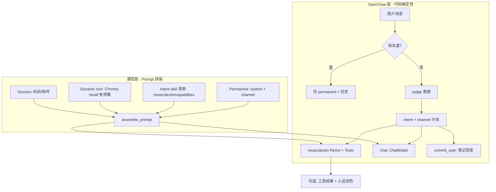

# 博客 Agent 提示词与 Skill 加载架构（参考 SillyTavern + OpenClaw）

> 面向 `G:\Projects\blog\python` 个人博客 Agent（蕾西亚 / QQ+Web / 音乐·行情·笔记）。  
> 本文是**设计参考**，与当前仓库实现对齐，并给出可渐进落地的示例代码（非全部已接入）。

---

## 1. 开源参考与分工

| 来源 | 仓库 / 文档 | 许可证 | 擅长 | 不擅长 |
|------|-------------|--------|------|--------|
| **酒馆 SillyTavern** | [SillyTavern/SillyTavern](https://github.com/SillyTavern/SillyTavern) · [World Info](https://docs.sillytavern.app/usage/core-concepts/worldinfo/) · [Character Design](https://docs.sillytavern.app/usage/core-concepts/characterdesign/) | AGPL-3.0 | 角色卡 permanent、Lorebook **触发 + token 预算 + 优先级**、历史与拼装顺序 | 业务工具链、ReAct、写库 |
| **OpenClaw / Anthropic Skill** | [Anthropic Skills](https://code.claude.com/docs/en/skills) · [AstrBot Skills](https://docs.astrbot.app/en/use/skills.html) | 各宿主不同 | **意图/任务 → Skill → Tools**、渐进披露（先简介再读 SKILL.md） | 纯 RP 的 lore 预算、扮演微调 |
| **character-skill 内容包** | 如 `firefly-skill`（MIT） | MIT | 模块化人设 md（profile/memory/relations） | **不含**加载引擎，依赖宿主 |

**结论（推荐组合）**

- **骨架（路由 + 工具）**：学 **OpenClaw** — 你们已有 `judge` → `music` / `aicoin` / `chat` / `commit_user` + 各 `route_graph`。
- **灵魂（人设 + 记忆注入 + 预算）**：学 **酒馆** — permanent `system.md`、按需 recall、快车道、lore 条优先级。
- **不要**：每轮拼接整个 skill 文件夹；不要把 ST 整进程嵌进博客后端。

---

## 2. 概念对照表

| SillyTavern | OpenClaw / Skill | 本博客（现状 / 目标） |
|-------------|------------------|------------------------|
| Character Description / Personality | `SKILL.md` 摘要 | `prompt/system.md`（详） |
| Scenario | Skill 任务说明 | `channel_web` / `channel_qq`（简） |
| World Info 单条 | Skill 附属 md | `skills/*.md`（简）+ 未来 `lore/*.yaml` |
| WI 关键词触发 | 用户消息匹配 skill 名 | `judge.md` + 关键词兜底 |
| WI Context % / Budget | Progressive Disclosure | `recall top_k` + `max_lore_chars`（待统一） |
| WI Priority | — | `priority` 丢低优条目（待做） |
| Constant WI | `auto_activate` | 仅 `system` + channel（常驻） |
| Chat History | 会话 | Redis / MySQL `ai_chat_message` |
| Tools | Skill 内脚本 / MCP | `run_music_react` / `run_aicoin_react` 等 |
| 纯生成回复 | Agent 执行后回复 | `ChatModel.chat` / `chat_once` |

---

## 3. 目标架构（混合）



### 3.1 拼装顺序（建议固定，对齐 ST「越近用户越重要」）

1. **Main / 主设定**：`system.md`（蕾西亚人设 + 子技能使用规则）  
2. **Channel**：`channel_web` 或 `channel_qq`  
3. **Intent skill**（仅路由命中）：`capabilities_chat` / `music` / `aicoin`…  
4. **Dynamic lore**（可选）：`【长期记忆】` 块（Chroma，有字符上限）  
5. **Session**：当前时间、开发者称呼  
6. **Chat history**：Redis/MySQL 最近 N 轮  
7. **User message**  
8. （工具型）Post-tool 润色时再叠 channel 语气段  

当前实现：`server/prompt_skills.py` 的 `build_system_prompt()` 已覆盖 1～3、部分 5；**4 建议在 `ChatModel` 调用前注入**（见 §6）。

---

## 4. 目录与文件约定

```text
python/
  prompt/
    judge.md               # 路由模型（全局）
    summary.md             # 记忆摘要专用模型（全局）
    character-skill/
      lacia-blog/          # 【主】角色包 · 单一真相源
        core/prompt.md     # Permanent（原 system.md）
        capabilities/      # OpenClaw 式能力清单（原 skills/）
        ops/bug_ops.md     # Bug Ops（原 bug_ops_system.md）
        lore/*.yaml        # 酒馆式 Lore
    system.md              # 迁移指针 → core/prompt.md
    skills/                # 迁移指针 → capabilities/
    lore/                  # 迁移指针 → character-skill/.../lore/
  docs/
    agent-prompt-architecture.md   # 本文件
  server/
    prompt_skills.py        # 已实现：分层读取
    skills_server/          # skill_registry + prompt_assembler
    lorebook.py             # 【示例】触发 + 优先级 + 截断
```

**原则**

- **详**：`system.md`、`summary.md`、`bug_ops_system.md`  
- **简**：`skills/*.md` 只列**已有功能 + 一行限定**；规则写在 `system.md`  
- **重 lore**：放 Chroma 或 `lore/*.yaml`，不要整份 `memory.md` 每轮进 prompt  

---

## 5. Lore 条目格式（参考酒馆 World Info）

`prompt/lore/lacia_static.yaml` 示例：

```yaml
# 酒馆类比：每条 = World Info entry
# keys: 触发词（扫描用户消息 + 可选滚动摘要）
# priority: 越大越不易被预算挤掉
# constant: true 则尽量常驻（仍建议总预算上限）
# budget_chars: 单条最大字符（粗略控 token）

budget_total_chars: 800   # 整块 dynamic lore 上限

entries:
  - id: lacia_name
    constant: true
    priority: 10
    budget_chars: 120
    content: |
      我是蕾西亚（Lacia），第一人称「我」。问名字时只答蕾西亚，不出戏。

  - id: no_fake_tools
    constant: true
    priority: 9
    budget_chars: 200
    content: |
      不能声称正在播放博客 BGM、查询 PV、已加歌；需用户发链接或明确意图后走路由。

  - id: entanglement_lexicon
    keys: ["btc", "比特币", "纠缠之缘", "定投", "行情"]
    priority: 7
    budget_chars: 150
    content: |
      对用户：BTC→纠缠之缘，USDT/U→原石；数字仅来自行情工具。

  - id: qq_brevity
    keys: []  # 由 channel=qq 在代码里强制注入，非关键词
    channel: qq
    priority: 8
    budget_chars: 80
    content: |
      QQ 私聊：1～2 句，约 60 字内，禁 Markdown 表格。
```

---

## 6. 示例代码

以下模块为**参考实现**，展示如何把酒馆预算与 OpenClaw 路由接到现有 `build_system_prompt` / `AgentEntry`。接入时复制到 `server/` 并按需改名。

### 6.1 快车道（酒馆：少触发、少烧 token）

```python
# server/chat_fast_track.py
from __future__ import annotations

import re

# 纯寒暄 / 极短句：跳过记忆子图、跳过 recall（主聊天仍可进行）
_SMALL_TALK_RE = re.compile(
    r"^(嗯|哦|好|好的|在吗|嗨|hello|hi|哈哈|hhh|…|\.\.\.)$",
    re.I,
)
_MEMORY_SIGNALS = ("我", "喜欢", "讨厌", "昨天", "记得", "加歌", "btc", "行情", "笔记")


def should_skip_memory_pipeline(message: str) -> bool:
    text = (message or "").strip()
    if not text:
        return True
    if len(text) <= 4 and not any(s in text for s in _MEMORY_SIGNALS):
        return True
    if _SMALL_TALK_RE.match(text):
        return True
    return False


def should_skip_recall(message: str, *, intent: str) -> bool:
    if intent != "chat":
        return True
    if should_skip_memory_pipeline(message):
        return True
    return False
```

**挂接点（`AgentEntry.run` 内，judge 之后）**

```python
from server.chat_fast_track import should_skip_memory_pipeline

# ...
if not should_skip_memory_pipeline(question):
    from server.embedding.embedding_user_memory import get_user_memory
    get_user_memory().process_user_message(question, user_id=user_id, channel=channel)
```

---

### 6.2 Lorebook 触发与预算（参考 ST `worldinfo`）

```python
# server/lorebook.py
from __future__ import annotations

from dataclasses import dataclass
from pathlib import Path
from typing import Any

import yaml

from utils.path_tools import get_abs_path


@dataclass
class LoreEntry:
    id: str
    content: str
    keys: list[str]
    priority: int = 5
    constant: bool = False
    budget_chars: int = 300
    channel: str | None = None  # None = 全渠道


@dataclass
class Lorebook:
    budget_total_chars: int
    entries: list[LoreEntry]

    @classmethod
    def load_yaml(cls, relative_path: str) -> Lorebook:
        path = get_abs_path(relative_path)
        raw = yaml.safe_load(path.read_text(encoding="utf-8"))
        entries = [
            LoreEntry(
                id=e["id"],
                content=(e.get("content") or "").strip(),
                keys=[str(k).lower() for k in (e.get("keys") or [])],
                priority=int(e.get("priority", 5)),
                constant=bool(e.get("constant", False)),
                budget_chars=int(e.get("budget_chars", 300)),
                channel=e.get("channel"),
            )
            for e in raw.get("entries", [])
        ]
        return cls(
            budget_total_chars=int(raw.get("budget_total_chars", 800)),
            entries=entries,
        )

    def select(
        self,
        message: str,
        *,
        channel: str,
        extra_text: str = "",
    ) -> str:
        """返回可拼进 system 的 lore 块（已截断）。"""
        hay = f"{message}\n{extra_text}".lower()
        ch = (channel or "web").strip().lower()
        picked: list[LoreEntry] = []

        for e in self.entries:
            if e.channel and e.channel != ch:
                continue
            if e.constant:
                picked.append(e)
                continue
            if e.keys and any(k in hay for k in e.keys):
                picked.append(e)

        picked.sort(key=lambda x: x.priority, reverse=True)

        parts: list[str] = []
        used = 0
        for e in picked:
            chunk = e.content.strip()
            if not chunk:
                continue
            cap = min(e.budget_chars, self.budget_total_chars - used)
            if cap <= 0:
                break
            if len(chunk) > cap:
                chunk = chunk[: cap - 1] + "…"
            parts.append(chunk)
            used += len(chunk)
            if used >= self.budget_total_chars:
                break

        if not parts:
            return ""
        return "【设定补充】\n" + "\n\n".join(parts)
```

---

### 6.3 统一 Prompt 组装器（衔接现有 `build_system_prompt`）

```python
# server/skills_server/prompt_assembler.py
from __future__ import annotations

from dataclasses import dataclass

from server.prompt_skills import build_system_prompt
from server.lorebook import Lorebook


@dataclass
class PromptContext:
    intent: str
    channel: str
    user_message: str
    user_logged_in: bool = False
    developer_name: str | None = None
    recall_block: str = ""          # 来自 Chroma format_recall_for_prompt
    lorebook: Lorebook | None = None
    episode_summary: str = ""       # 记忆滑动窗口摘要，供 recall 查询句


class PromptAssembler:
    """OpenClaw 路由 + 酒馆拼装的统一入口。"""

    def build_system(self, ctx: PromptContext) -> str:
        parts: list[str] = []

        # 1～3：现有分层（permanent + channel + intent/capabilities）
        base = build_system_prompt(
            intent=ctx.intent,
            user_logged_in=ctx.user_logged_in,
            channel=ctx.channel,
            developer_name=ctx.developer_name,
        )
        parts.append(base)

        # 4：静态 lore（YAML，关键词/constant）
        if ctx.lorebook:
            lore = ctx.lorebook.select(
                ctx.user_message,
                channel=ctx.channel,
                extra_text=ctx.episode_summary,
            )
            if lore:
                parts.append(lore)

        # 5：动态用户记忆（向量库，勿用用户问 Agent 的句子裸搜）
        if ctx.recall_block.strip():
            parts.append(ctx.recall_block.strip())

        return "\n\n---\n\n".join(p for p in parts if p)


def build_recall_query(ctx: PromptContext) -> str:
    """双路 query：滚动摘要优先，其次用户原话（参见此前讨论）。"""
    summary = (ctx.episode_summary or "").strip()
    if summary:
        return f"与用户相关的长期事实：{summary}"
    return (ctx.user_message or "").strip()
```

---

### 6.4 接入 `ChatModel`（示例）

```python
# 在 server/agent.py 的 chat / chat_once 中，替换单纯 build_system_prompt 调用：

from server.skills_server.prompt_assembler import PromptAssembler, PromptContext, build_recall_query
from server.chat_fast_track import should_skip_recall
from server.lorebook import Lorebook

_assembler = PromptAssembler()
_lorebook = Lorebook.load_yaml("skills/character-skill/lacia-blog/lore/lacia_static.yaml")


def _build_chat_system(
    *,
    question: str,
    session_id: str,
    user_id: int,
    channel: str,
    developer_name: str,
    intent: str = "chat",
) -> str:
    recall_block = ""
    episode_summary = ""

    if not should_skip_recall(question, intent=intent):
        from server.embedding.embedding_user_memory import get_user_memory
        mem = get_user_memory()
        ep = mem.get_episode(user_id)
        episode_summary = ep.running_summary or ""
        q = build_recall_query(
            PromptContext(
                intent=intent,
                channel=channel,
                user_message=question,
                episode_summary=episode_summary,
            )
        )
        recall_block = mem.format_recall_for_prompt(user_id, q, top_k=3, channel=channel)

    return _assembler.build_system(
        PromptContext(
            intent=intent,
            channel=channel,
            user_message=question,
            developer_name=developer_name or None,
            recall_block=recall_block,
            lorebook=_lorebook,
            episode_summary=episode_summary,
        )
    )
```

---

### 6.5 OpenClaw 式 Skill 注册表（可选，与 judge 对齐）

```python
# server/skills_server/skill_registry.py
from __future__ import annotations

from dataclasses import dataclass


@dataclass(frozen=True)
class SkillMeta:
    id: str
    description: str          # 给 judge / 渐进披露用的一行简介
    intent: str               # 路由命中后 intent
    prompt_file: str          # skills/skills/xxx.md
    tools_route: str | None   # music | aicoin | None=纯对话


SKILLS: tuple[SkillMeta, ...] = (
    SkillMeta("chat", "闲聊陪伴，无工具", "chat", "capabilities_chat.md", None),
    SkillMeta("music", "QQ音乐链接、听歌排行、报告", "music", "music.md", "music"),
    SkillMeta("aicoin", "只读行情/定投", "aicoin", "aicoin.md", "aicoin"),
    SkillMeta("note_reply", "笔记下回复", "commit_user", "comment.md", None),
)


def skill_catalog_for_judge() -> str:
    """可追加到 judge 人类消息，减少误判（optional）。"""
    lines = ["【可用能力】"]
    for s in SKILLS:
        lines.append(f"- {s.id}: {s.description}")
    return "\n".join(lines)
```

---

## 7. 记忆子图（summary 模型 · 详提示词）

保持 `prompt/summary.md` **详细**（不压缩判断逻辑）。流水线：

```text
用户消息 →（快车道跳过）→ UserMemory.process_user_message
  → 摘要 LLM（summary.md）
  → commit/split → Chroma upsert
聊天回复前 → build_recall_query → Chroma query → recall_block → assemble_system
```

与 **酒馆** 区别：长期事实用 **向量 + 摘要**，不是数百条手写 WI。  
与 **OpenClaw** 区别：记忆是**旁路子图**，不占用主 Skill 的 tool 列表。

---

## 8. Token 预算建议

| 块 | 建议上限（字符粗算） | 说明 |
|----|----------------------|------|
| permanent（system+channel+capabilities） | ~1200～1800 | 已分层，可控 |
| lore YAML | 600～800 | `budget_total_chars` |
| recall | 400～600 | top_k=3，每条摘要短 |
| 历史 10 轮 | 变动最大 | 优先压轮数而非砍人设 |
| judge | 独立请求 | ~300～500 |

---

## 9. 实施路线图

| 阶段 | 内容 | 参考 |
|------|------|------|
| **P0** | 维持 `prompt_skills.build_system_prompt`；`capabilities_chat` 防编造 | 已有 |
| **P1** | `chat_fast_track` + `should_skip_recall` | 酒馆「少触发」 |
| **P1** | `PromptAssembler` + `build_recall_query` | 双路 query |
| **P2** | `lorebook.yaml` + `Lorebook.select` | ST World Info |
| **P2** | MySQL `channel` 迁移（历史分渠道） | 运维 |
| **P3** | Redis 记忆提及曲线 → 升格 Chroma | 前文艾宾浩斯方案 |

---

## 10. 和 firefly-skill / 酒馆 / OpenClaw 的安装关系

| 你想用 | 做法 |
|--------|------|
| firefly 式多文件人设 | 只把 `prompt.md` 当 permanent，其余拆 Chroma 或 `lore/*.yaml` |
| 酒馆角色卡 | 不必装 ST；抄 WI 的 **keys / priority / budget** 到 YAML |
| OpenClaw 技能 zip | 不必装 OpenClaw；`skills/` + `judge` + `route_graph` 已是宿主 |
| 整站换成酒馆 UI | 与现有 Java API / QQ 桥接重复建设，**不推荐** |

---

## 11. 相关仓库文件（当前实现）

| 文件 | 作用 |
|------|------|
| `server/prompt_skills.py` | 分层读 md，aicoin `@section` |
| `server/agent_entry.py` | judge + intent × channel 分支 |
| `server/agent.py` | ChatModel 流式/一次性 |
| `server/embedding/embedding_user_memory.py` | 滚动摘要 + Chroma |
| `prompt/system.md` | Permanent + 子技能规则 |
| `scripts/test_channel_tone.py` | Web/QQ 语气对比 |
| `scripts/test_user_memory_scenarios.py` | 记忆 5 场景 |

---

## 12. 延伸阅读

- SillyTavern 源码关键词：`world_info`、`getWorldInfoPrompt`、`budget`、`priority`  
- AstrBot：Progressive Disclosure（先 skill 描述，再加载 SKILL.md）  
- 本项目对话记录：`docs/agent-prompt-architecture.md`（本文件）

---

*文档版本：2026-05，与蕾西亚人设及 `prompt/` 分层约定一致。*	
