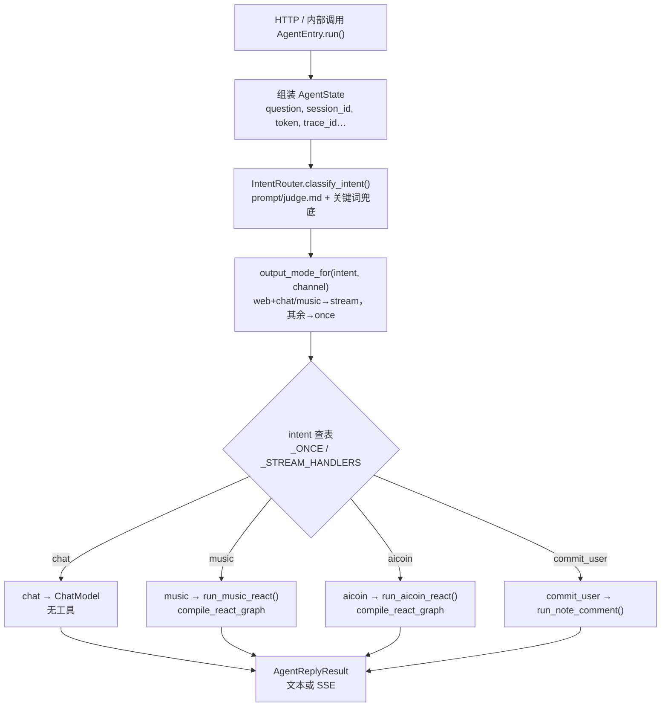
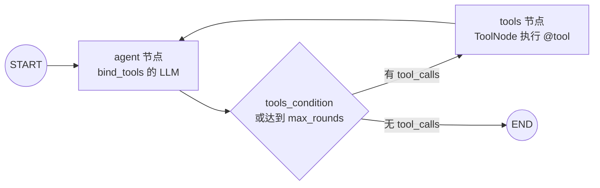
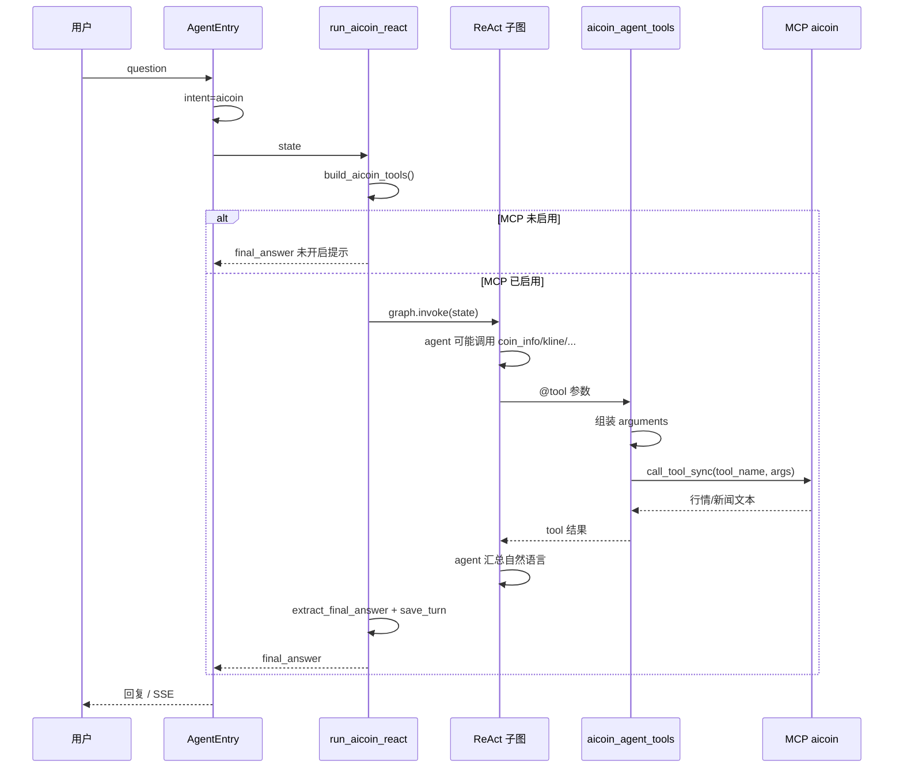

# AiCoin 行情 Agent 链路说明

本文说明：用户一句话如何进入 **ReAct 子图**、图里各节点做什么、与 **MCP** 的关系，以及如何扩展。

## 1. 总览（主链路）

当前架构是 **「意图路由 + 按意图执行分支」**，不是单一 LangGraph 大主图。  
`music` / `aicoin` 各自在 `run_*_react` 里 **临时编译** 一个标准 ReAct 子图并 `invoke`。



**触发 `run_aicoin_react` 的条件：**

1. `AgentEntry.run()` 得到 `intent == "aicoin"`（judge 或关键词覆盖，或 `force_intent="aicoin"`）。
2. **权限**：`server/aicoin_access.py` — 仅 `user_role=admin` 或 `account` 与 `.env` 的 `DEVELOPER_EMAIL` 一致时保留 aicoin；否则 **`intent` 降级为 `chat`**（普通用户问币价走闲聊，不调 MCP）。
3. `agent_entry._ONCE_HANDLERS["aicoin"]` 调用 `run_aicoin_react(state)`。

## 2. ReAct 子图（通用模板）

实现位置：`server/route_graph/react_subgraph.py` 的 `compile_react_graph()`。



| 节点 | 职责 |
|------|------|
| **agent** | 首次无 `messages` 时调用 `build_initial_messages(state)` → System + 历史 + 当前 Human；再 `model.invoke`；可返回 `tool_calls` |
| **tools** | 执行 LangChain 工具（如 `coin_info`、`kline`） |
| **条件边** | 有 tool_calls → tools；否则 END；超过 `DEFAULT_MAX_REACT_ROUNDS`（6）强制 END |

`run_aicoin_react` 与 `run_music_react` 的差异仅在：

- `tools=build_aicoin_tools()`（MCP 未开则 `[]`，直接返回提示，不编译图）
- `build_initial_messages` / `subgraph="aicoin"` / 提示词 `intent="aicoin"`

## 3. AiCoin 专用数据流



## 4. 配置与文件

| 文件 | 作用 |
|------|------|
| `config/mcp_servers.json` | `aicoin` stdio：`npx -y @aicoin/aicoin-mcp` |
| `.env` | `AICOIN_MCP_ENABLED=true` |
| `server/tools/aicoin_agent_tools.py` | LangChain 工具封装 → `_call_mcp` |
| `server/route_graph/aicoin_route.py` | `run_aicoin_react` |
| `server/agent_entry.py` | 意图 → handler 表 |
| `server/intent_router.py` | judge + 关键词 `aicoin` |
| `prompt/judge.md` | 路由规则含 aicoin |
| `prompt/skills/aicoin.md` | 子图 system 技能（只读、定投视角） |

## 5. 本地验证

```bash
# MCP
python scripts/probe_mcp.py --list
python scripts/probe_mcp.py aicoin

# 强制走 aicoin 子图（不依赖 judge）
# AgentEntry.run(..., force_intent="aicoin")
```

## 6. 输出形态

| channel | intent | 模式 |
|---------|--------|------|
| web | chat, music | stream（SSE 增量） |
| web | aicoin | **once**（整段返回；也可改为 stream，handler 已具备 `_stream_aicoin`） |
| qq 等 | aicoin | once |

若希望 web 上 aicoin 也流式输出，在 `output_mode_for()` 中加入 `aicoin` 即可。

## 7. 历史消息

`aicoin_route` 默认拉取最近 **4** 轮历史（上限 8），用于「它呢 / 刚才那个币」类指代。  
涉及现价、涨跌幅时，应在 `prompt/skills/aicoin.md` 中要求模型 **必须重新调工具**，避免复述过期数字。
